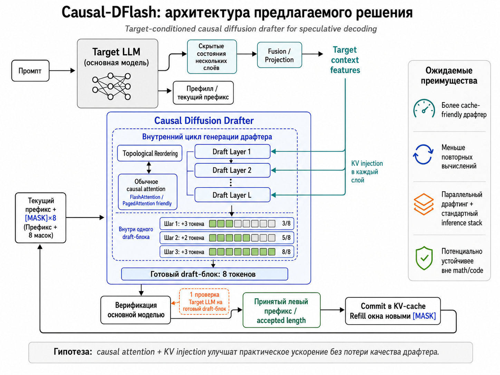

# Causal-DFlash

**Каузальный диффузионный драфтер с обусловливанием на основной модели для спекулятивного декодирования**

Causal-DFlash — исследовательский проект, в котором изучается возможность объединить параллельный диффузионный драфтинг из
[DFlash](https://arxiv.org/abs/2602.06036) с cache-friendly архитектурой на основе стандартного causal attention из
[WeDLM](https://arxiv.org/abs/2512.22737).

Цель проекта — разработать лёгкий диффузионный драфтер, который параллельно генерирует несколько будущих токенов, использует скрытые представления основной LLM и остаётся совместимым со стандартным KV-кэшем и оптимизированными движками инференса.

> Исследовательский проект для программы **«Лето с AIRI 2026»**, направление Efficient Deep Learning.

---

## Мотивация

Спекулятивное декодирование ускоряет генерацию LLM с помощью небольшой черновой модели — драфтера. Драфтер предлагает несколько будущих токенов, после чего основная модель проверяет их одним параллельным проходом.

DFlash заменяет последовательный авторегрессионный драфтер на лёгкую блоковую диффузионную модель. Такой драфтер может генерировать несколько токенов параллельно, однако двунаправленное внимание внутри диффузионного блока плохо совместимо со стандартным prefix KV caching. Кроме того, практическое ускорение DFlash может заметно зависеть от типа задачи, batch size и особенностей serving-системы.

WeDLM показывает, что диффузионное восстановление масок можно реализовать с обычным causal attention при помощи Topological Reordering. Это позволяет использовать стандартные механизмы KV-кэширования, FlashAttention, PagedAttention и CUDA Graphs.

Causal-DFlash исследует, можно ли перенести эти идеи в компактный target-conditioned драфтер для спекулятивного декодирования.

---

## Предлагаемая архитектура

<p align="center">
  
</p>

Предлагаемый метод состоит из четырёх основных этапов.

### 1. Извлечение контекста основной модели

Target LLM выполняет prefill текущего префикса. Скрытые состояния нескольких её слоёв объединяются при помощи небольшого проекционного слоя и образуют `target context features`.

Эти признаки передаются в каждый слой драфтера через KV injection.

### 2. Инициализация draft-блока

К текущему префиксу добавляется окно из маскированных позиций:

```text
Текущий префикс + [MASK] × 8
